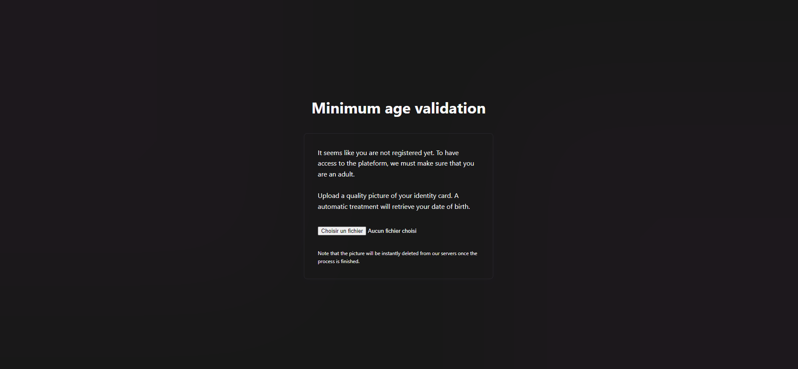
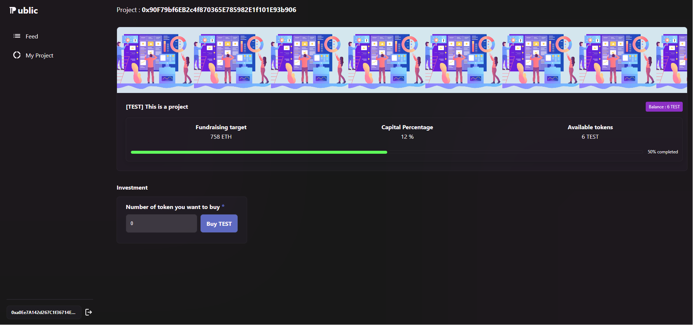

# [SCHOOL PROJECT]

# Public - A web3 secure investment platform - {ReactJs, Solidity, Flask}
Groupe : SALON Tom, FOURNIEZ Théo, GILLOT Quentin

## Lien vers les différentes ressources

* [Vidéo de démonstration](https://drive.google.com/file/d/1IOIS0xdT2hrUI0VBE3dRWXQVFubkjSxl/view?usp=drive_link)

## Explication du Projet
Nous avons développé une application de crowdfunding décentralisée permettant aux utilisateurs majeurs (qui passent la vérification d'identité) de faire financer leur projet en vendant des parts de leurs entreprises sous la forme de token.
L'application contient donc 2 principales fonctionnalités : 
- La création d'un projet ainsi que de son token
- La possibilité d'investir dans les projets d'autres créateurs via l'achat de token

## Répartion du travail
Nous avons réparti le travail en agissant chacun sur une des briques principales du projet (Frontend, Smart Contract et Serveur IA de reconnaissance de pièce d'identité)

### Front
Tom s'est occupé de la partie frontend en designant l'ensemble des maquettes au préalable. 
Il s'est ensuite occupé de construire l'ensemble de l'interface utilisateur et de faire le lien avec le smart contract en appelant les différentes fonctions permettant le fonctionnement de l'application :  
Connexion à l'application en appelant Metamask : 

Page de vérification d'identité :

Page listant tous les projets disponibles :

Page de création de projet : 

Investissement sur un projet : 

### Smart Contract
Théo s'est occupé de l'ensemble de la conception des smart contracts : 
- ProjectToken : ce smart contract héritant d'ERC20 permet le mint d'un token qui représente les parts de l'entreprise. Le montant total de tokens existant est toujours de 100 * 10¹⁸ pour représenter 100% des parts. 
- ProjectTokenFactory : ce smart contract est utilisé pour la création de projet et du token y étant lié. De plus il est utilisé pour lister l'ensemble des projets.Il est finalement appelé par l'api de vérification d'identité pour whitelister les différents utilisateurs en fonction de l'âge de ceux-ci.
- ProjectTokenMarket : il permet l'ajout de token sur le marché. Afin de pouvoir lister un token sur le marché, l'utilisateur doit d'abord autoriser ce contrat à dépenser le bon nombre de ProjectToken en son nom (grâce au mécanisme ERC20 d'[allowance](https://docs.openzeppelin.com/contracts/5.x/api/token/erc20#IERC20-allowance-address-address-)). Ensuite l'acheteur passe par la fonction purchaseToken pour acheter un certain nombre de token listé.

### Serveur IA de reconnaissance de pièce d'identité
Quentin s'est occupé de la conception du serveur python permettant la validation de majorité des utilisateurs:
- un endpoint REST est exposé sur le serveur qui reçoit une image en entrée
- l'image est passée dans une IA qui à travers plusieurs mécanismes (rotation, greyscale,...) récupère l'ensemble du texte reconnu sur l'image
- un ensemble de règles (regex) sont définies pour récupèrer uniquement les données qui nous intéressent ici à savoir la date de naissance et le numéro de carte d'identité
- le serveur agit en tâche de fond grâce à la parallélisation de threads permettant à plusieurs utilisateurs d'appeler le endpoint à la fois et sans bloquer l'action de l'utilisateur sur le frontend.
- la carte d'identité est entièrement supprimée par le serveur après le traitement de l'IA

